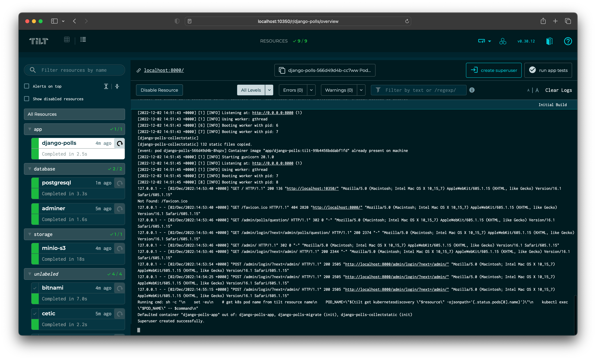
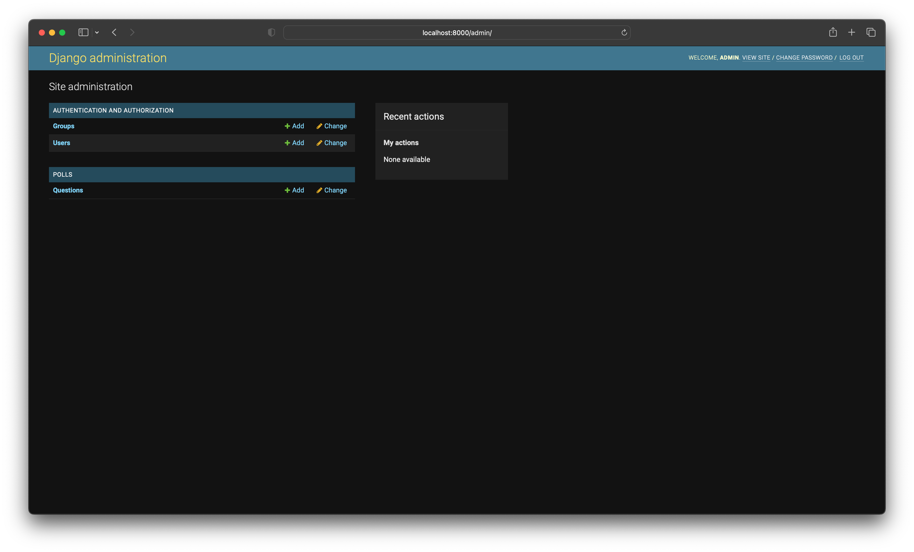
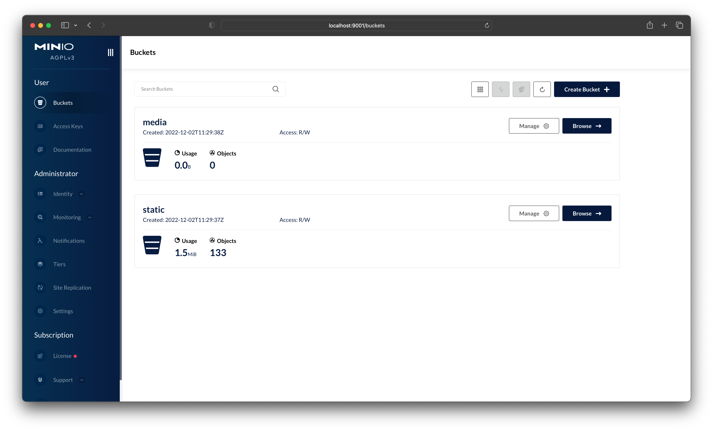
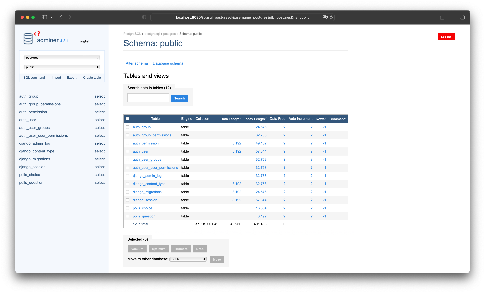

## Django (polls app) development in Kubernetes using Tilt with PostgreSQL, Adminer and MinIO installed using Helm.

Sample Django project demonstrating how to use Tilt with Helm to develop a Django application in Kubernetes. This project uses the [polls app](https://docs.djangoproject.com/en/4.1/intro/tutorial01/) from the Django documentation and is configured to use PostgreSQL and MinIO as the database and file storage backend respectively.


### QUIK HOWTO: Local Development with using Tilt

Simple example showcasing an option for a local development setup for Django app in kubernetes.

You need these tools to set this up and try it for yourself:
- [docker](https://www.docker.com): this is where the local cluster will be hosted
- [kind](https://kind.sigs.k8s.io/docs/user/quick-start/): installs a kind cluster in you docker
- [kubectl](https://kubernetes.io/docs/tasks/tools/): the means of interacting with the kubernetes cluster
- [helm](https://k3d.io): package manager for kubernetes
- [tilt](https://tilt.dev): smart rebuilds and live updates making your live easier. Tilt define your dev environment as code. Very usable for microservice apps on Kubernetes, and better than Skaffold ).

## Installing the cluster
Create a local kind cluster with nginx ingress using:

```
make up
```

## Running tilt
```
# Environment variables (edit as needed)
cp .env.example .env

tilt up
```


### Check 
````
kubectl get po
````

## Clean dev environment
```
tilt down
make clean
```

## Notes:
When you run `tilt up` for the first time, Tilt will read .env file, set the environment variables and create secrets in the cluster for the Django app, PostgreSQL and minIO, then install Helm charts for PostgreSQL (with simple [adminer database management](https://www.adminer.org/)), MinIO (with init buckets) and deploy the Django application (migrations and collectstatic will be run automatically) using previously created secrets to the local Kubernetes cluster. This will take a few minutes. Subsequent runs of `tilt up` will be much faster.


###  Create a new superuser
From Tilt UI (http://localhost:10350), click from the left sidebar "django-polls" resource and then click the "create super user" button. This will create a new super user for the Django admin site with password from the `DJANGO_SUPERUSER_PASSWORD` environment variable.



### Access the Django admin site
You can access the Django admin site at https://localhost:8000/admin. Login using the username and password from the `DJANGO_SUPERUSER_USERNAME` and `DJANGO_SUPERUSER_PASSWORD` environment variables.



### Access the MinIO Console
You can access the MinIO Console at https://localhost:9001. Login using the username and password from the `MINIO_ROOT_USER` and `MINIO_ROOT_PASSWORD` environment variables.



### Access the Adminer PostgreSQL database management
You can access the Adminer PostgreSQL database management at https://localhost:8080. Login using the username and password from the `POSTGRESQL_USER` and `POSTGRESQL_PASSWORD` environment variables.




